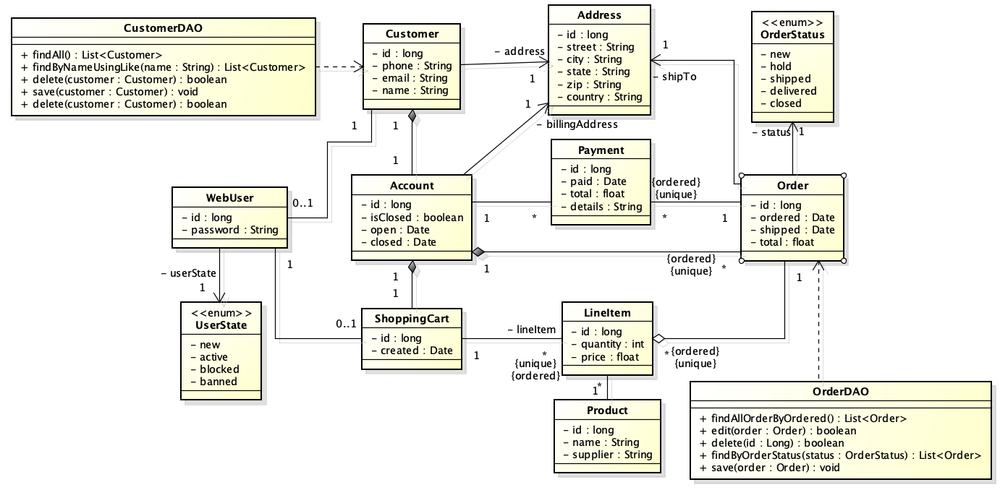

# Prova 2
Implemente em um projeto do Maven o modelo abaixo.

## Critérios de avaliação
 - (**3.0 pontos**) Implementação das entidades.
 - (**3.0 pontos**) Implementação dos DAOs.
 - (**2.0 pontos**) Teste de Unidade para PessoaDAO (mínimo 2 asserções diferentes por método).
 - (**2.0 pontos**) Teste de Unidade para TurmaDAO (mínimo 2 asserções diferentes por método).
 
 **A entrega é exclusiva pelo GITHUB**
